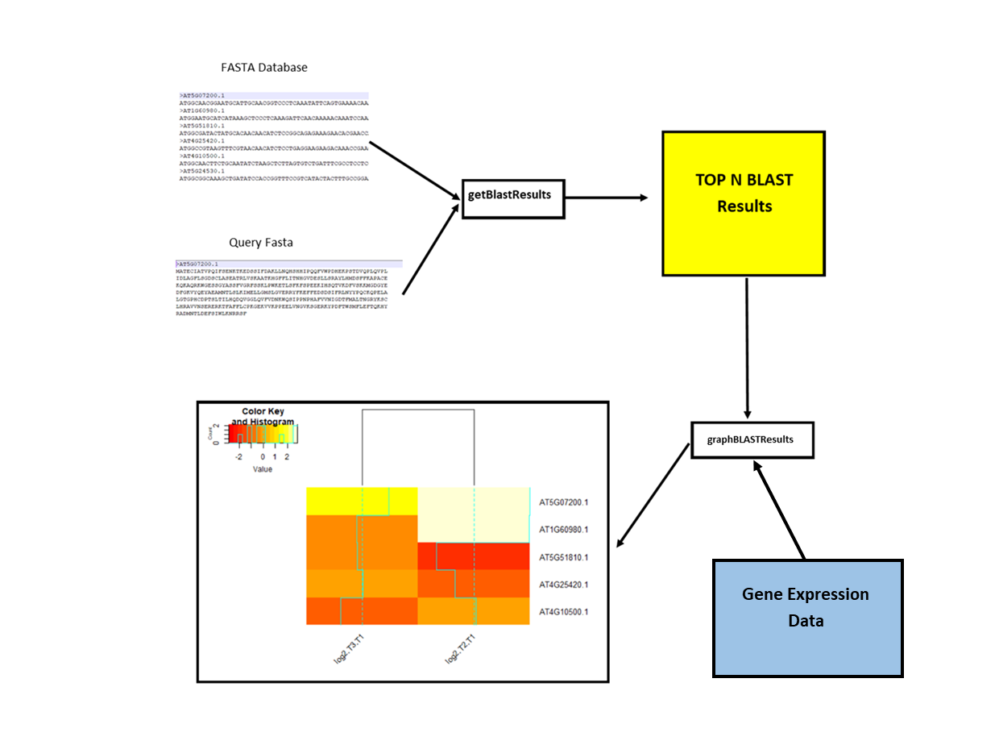

<!-- README.md is generated from README.Rmd. Please edit that file -->

```{r, include = FALSE}
knitr::opts_chunk$set(
  collapse = TRUE,
  comment = "#>",
  fig.path = "man/figures/README-",
  out.width = "100%"
)
```

# DEGSimilar

<!-- badges: start -->
<!-- badges: end -->

The goal of DEGSimilar is to provide an easy pipeline in order to analyze the results of Differential Gene Expression (DEG).
This is done by providing an easy method to compare DEGs of choice to other DEGs based on BLAST similiarity within a user-specified
database.

## Installation

In order to use (and install) this package the BLAST+ executable must be installed. It may be installed from here:
https://blast.ncbi.nlm.nih.gov/Blast.cgi?CMD=Web&PAGE_TYPE=BlastDocs&DOC_TYPE=Download

In addition, R must be able to recognize the path to the BLAST executable. This may be checked by running the following:

```r
Sys.which("blastn")
Sys.which("makeblastdb")
```

If these do not return a proper directory, then you must specify to R the directory at which these executables are located.

You can then install the package from [GitHub](https://github.com/) with:

``` r
require("devtools")
devtools::install_github("GeorgeLy7/DEGSimilar", build_vignettes = TRUE)
```
In order to run the shiny app:

```r
DEGSimilar::runDEGSimilar()
```

## Overview

DEGSimilar contains the following functions:

  *getBlastResults*: This function takes in two fasta files, one which contains one entry which is the designated query sequence.
    The other fasta file is the file which the user wishes to create a BLAST database out of. The function will return the typical
    BLAST results such as queryID, subjectID, E-value, bit score etc.
    
  
  *graphBLASTResults*: This function takes in a list of BLAST results produced by getBLastResults and a list or dataframe containing the 
    gene expression data in columns and the same gene names as the row names. The function outputs a heatmap of the gene expression data
    of the genes listed in the BLAST result.
    
For more information please refer to the vignette, this can be done by running:

```r
browseVignettes("DEGSimilar")
```
An example pipeline of the use of this package is as follows:




## Example

This is a basic example which shows you how to solve a common problem:

```{r example}
library(DEGSimilar)
blastResults <- getBlastResults("./data-raw/exampleQueryFasta.fasta","./data-raw/exampleDatabase.fasta",dbType="nucl", userFastaType="prot")
blastResults
geneData <- read.csv("./data-raw/GeneDataExample.csv",encoding="UTF-8",row.names=1)
geneData
graphBLASTResults(blastResults=blastResults, geneData=geneData)

```

## Contributions

The author of this package is George Ly. 

The *getBlastResults* function uses the `rBLAST` package in order to run the BLAST+ executables on the local machine. The function also uses the `Biostrings` package in order to load fasta files into R.

The *graphBLASTResults* function uses the `gplots` package in order to create the heatmap.

The example sequence data is taken from the TAIR11 *Arabidopsis thaliana* genome.The example gene expression data is not real data.

## References

R Core Team (2020). R: A language and environment for statistical computing. R Foundation for Statistical Computing, Vienna, Austria. https://www.R-project.org/

Michael Hahsler and Anurag Nagar (2019). rBLAST: Interface to the Basic Local Alignment Search Tool (BLAST). R package version
  0.99.2.
  
H. Pagès, P. Aboyoun, R. Gentleman and S. DebRoy (2020). Biostrings: Efficient manipulation of biological strings. R package
  version 2.58.0. https://bioconductor.org/packages/Biostrings

Gregory R. Warnes, Ben Bolker, Lodewijk Bonebakker, Robert Gentleman, Wolfgang Huber, Andy Liaw, Thomas Lumley, Martin Maechler,
  Arni Magnusson, Steffen Moeller, Marc Schwartz and Bill Venables (2020). gplots: Various R Programming Tools for Plotting Data. R
  package version 3.1.0. https://CRAN.R-project.org/package=gplots


## Acknowledgements

This package was developed for BCB410H: Applied Bioinformatics, University of Toronto, Toronto, CANADA, 2020-2021. DEGSimilar welcomes issues, enhancement requests, and other contributions. To submit an issue, email at george.ly@mail.utoronto.ca or glyfully@gmail.com
