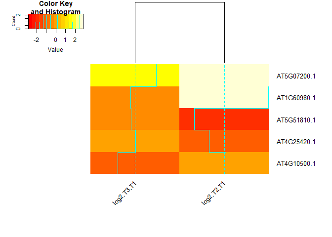

<!-- README.md is generated from README.Rmd. Please edit that file -->

# DEGSimilar

<!-- badges: start -->

<!-- badges: end -->

The goal of DEGSimilar is to provide an easy pipeline in order to
analyze the results of Differential Gene Expression (DEG). This is done
by providing an easy method to compare DEGs of choice to other DEGs
based on BLAST similiarity within a user-specified database.

## Installation

You can install the package from [GitHub](https://github.com/) with:

``` r
require("devtools")
devtools::install_github("GeorgeLy7/DEGSimilar")
```

In order to use this package the BLAST+ executable must be installed. It
may be installed from here:
<https://blast.ncbi.nlm.nih.gov/Blast.cgi?CMD=Web&PAGE_TYPE=BlastDocs&DOC_TYPE=Download>

## Overview

DEGSimilar contains the following functions:

*getBlastResults*: This function takes in two fasta files, one which
contains one entry which is the designated query sequence. The other
fasta file is the file which the user wishes to create a BLAST database
out of. The function will return the typical BLAST results such as
queryID, subjectID, E-value, bit score etc.

*graphBLASTResults*: This function takes in a list of BLAST results
produced by getBLastResults and a list or dataframe containing the gene
expression data in columns and the same gene names as the row names. The
function outputs a heatmap of the gene expression data of the genes
listed in the BLAST result.

## Example

This is a basic example which shows you how to solve a common problem:

``` r
library(DEGSimilar)
blastResults <- getBlastResults("./data-raw/exampleQueryFasta.fasta","./data-raw/exampleDatabase.fasta",dbType="nucl", userFastaType="prot")
#> [1] "BLAST Databse already exists for fastaDatabase file, skipping database creation"
blastResults
#>       QueryID   SubjectID Perc.Ident Alignment.Length Mismatches Gap.Openings
#> 1 AT5G07200.1 AT5G07200.1     100.00              380          0            0
#> 2 AT5G07200.1 AT1G60980.1      73.16              380         94            3
#> 3 AT5G07200.1 AT5G51810.1      64.04              381        120            7
#> 4 AT5G07200.1 AT4G25420.1      62.63              380        129            6
#> 5 AT5G07200.1 AT4G10500.1      33.24              346        204            9
#>   Q.start Q.end S.start S.end      E Bits
#> 1       1   380       1  1140  0e+00  797
#> 2       4   380       4  1128  0e+00  577
#> 3       1   374       1  1113 3e-174  485
#> 4       1   374       1  1119 6e-174  484
#> 5      34   370      49  1032  4e-56  180
geneData <- read.csv("./data-raw/GeneDataExample.csv",encoding="UTF-8",row.names=1)
geneData
#>             log2.T2.T1 log2.T3.T1
#> AT5G07200.1   2.864743   1.376051
#> AT1G60980.1   2.835934  -0.293910
#> AT5G51810.1  -1.920527  -0.262871
#> AT4G25420.1  -0.961024   0.015807
#> AT4G25420.2   0.531142  -2.409042
#> AT4G10500.1   0.105212  -1.098387
#> AT5G24530.1  -2.616703  -5.646451
graphBLASTResults(blastResults=blastResults, geneData=geneData)
```



## Contributions

The author of this package is George Ly.

The *getBlastResults* function uses the `rBLAST` package in order to run
the BLAST+ executables on the local machine. The function also uses the
`Biostrings` package in order to load fasta files into R.

The *graphBLASTResults* function uses the `gplots` package in order to
create the heatmap.

The example sequence data is taken from the TAIR11 *Arabidopsis
thaliana* genome.The example gene expression data is not real data.

## References

R Core Team (2020). R: A language and environment for statistical
computing. R Foundation for Statistical Computing, Vienna, Austria.
<https://www.R-project.org/>

Michael Hahsler and Anurag Nagar (2019). rBLAST: Interface to the Basic
Local Alignment Search Tool (BLAST). R package version 0.99.2.

H. Pagès, P. Aboyoun, R. Gentleman and S. DebRoy (2020). Biostrings:
Efficient manipulation of biological strings. R package version 2.58.0.
<https://bioconductor.org/packages/Biostrings>

Gregory R. Warnes, Ben Bolker, Lodewijk Bonebakker, Robert Gentleman,
Wolfgang Huber, Andy Liaw, Thomas Lumley, Martin Maechler, Arni
Magnusson, Steffen Moeller, Marc Schwartz and Bill Venables (2020).
gplots: Various R Programming Tools for Plotting Data. R package version
3.1.0. <https://CRAN.R-project.org/package=gplots>

## Acknowledgements

This package was developed for BCB410H: Applied Bioinformatics,
University of Toronto, Toronto, CANADA, 2020-2021. DEGSimilar welcomes
issues, enhancement requests, and other contributions. To submit an
issue, email at <george.ly@mail.utoronto.ca> or <glyfully@gmail.com>
